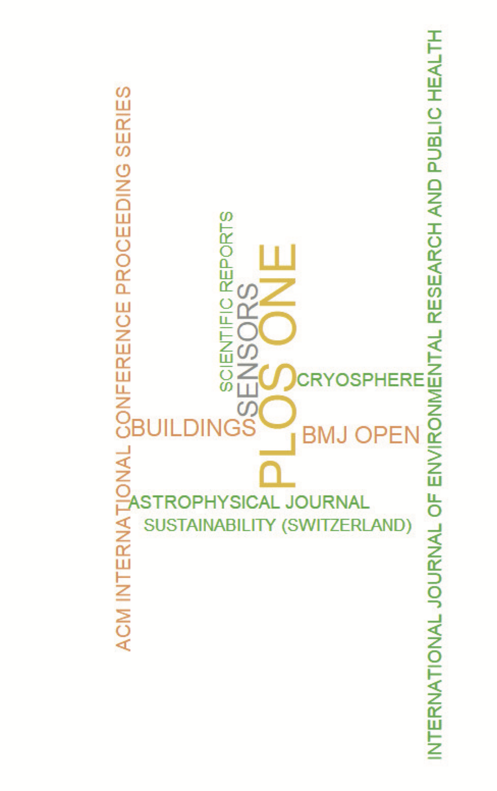
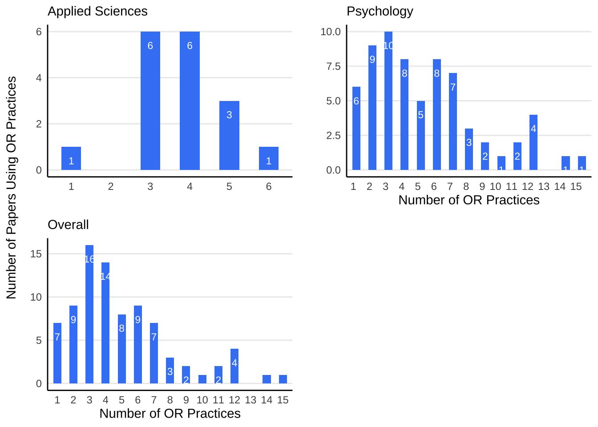

```{r setup, include=FALSE}
options(htmltools.dir.version = FALSE)
knitr::opts_chunk$set(echo = TRUE)
```

```{r echo=F, message=F, warning = F}
require(xaringanExtra) 
require(stargazer)
require(tidyverse)
require(knitr)
```

```{r xaringan-logo, echo=FALSE}
xaringanExtra::use_logo("NU2.png")
```

```{r xaringan-tile-view, echo=FALSE}
xaringanExtra::use_tile_view()
```


<style>
.main-container {
  max-width: unset;
}
</style>

## Outline

* Two projects
* One project in more detail


```{r, out.width = "600px", echo=FALSE, fig.align='center'}
knitr::include_graphics("https://media.giphy.com/media/3o7aTskHEUdgCQAXde/giphy.gif") 
```

---
## RIS internal Funding

* 'Biblionetrics' project (C. Malcolm, L. Maughan)

--

* Open Research Practices and internal REF ratings (A. Anguera de la Rosa, T. Fitzpartick, C. Malcolm, M. Smith, I. Sutcliffe)

--

```{r, out.width = "400px", echo=FALSE, fig.align='center'}
knitr::include_graphics("https://media.giphy.com/media/C8Y3dkORr4jjkw4jBJ/giphy.gif") 
```

---
## Biblionetrics

* Identify where we publish open access, who are the most prolific authors? And general bibliometric stuff (2022:2023, >1,300 papers, 770 documents 'Green')

--

* Close but no cigar: 'citedness' (logit .327 +/- .169, _z_ = 1.94, _p_ = .052 -- Odds ratio of around 1.39)

--

* Everything is [here](https://connmal.github.io/Bibliometrix_Northumbria/About.html). Including some network graphs.

```{r, out.width = "250px", echo=FALSE, fig.align='center'}
knitr::include_graphics("https://media.giphy.com/media/jbKbdoKJOFusHTjl80/giphy-downsized-large.gif") 
```


---
## Example: word cloud


```{r wordcloud, out.width = "300px", echo=FALSE, fig.align='center'}
 
```

---
## Open Research and REF

* Two independent coders. Very first batch of our internal REF scoring exercise (two raters and moderated score).

--

* Coding scheme developed by Norris et al. (2022).<sup>1<sup> 

--

* 15 practices (e.g., pre-registration available, data available). Generated a count variable.

--

* There was near perfect consistency and the coders met and resolved any discrepancies. **Liberal** coding... .

--

* Reviewer scores 12 point scale (1- → 1 … 4+ → 12). U's excluded (7 - all from psych.).

.footnote[
[1] Norris, E., Sulevani, I., Finnerty, A. N., & Castro, O. (2022). Assessing Open Science practices in physical activity behaviour change intervention evaluations. BMJ Open Sport & Exercise Medicine, 8(2), e001282. [https://doi.org/10.1136/bmjsem-2021-001282](https://doi.org/10.1136/bmjsem-2021-001282)
]

???
Note the limitations of creating a count score.

---
## Descriptive statistics


* 67 psychology papers / 17 applied sciences paper.

--

* Tables. [Individual Practices](Practice.html) and [OR count / Final Score](OR_count_final_Ref_score_table.html).

---
## Bar chart


```{r bar chart, out.width = "600px", echo=FALSE, fig.align='center'}
 
```

---
### Does frequency of OR practices differ between groups?

* Ordinal logistic regression analysis. 

--

* The groups did not significantly differ (Coefficient = 0.5679+/-0.4396, _z_ = 1.292, _p_ = .196). (but small n)

```{r  out.width = "400px", echo=FALSE, fig.align='center'}
knitr::include_graphics("https://media.giphy.com/media/MDs0DZLHum4BRJglM5/giphy.gif") 
```


---
### Associations between OR count and final score

* **Overall**: Somers Dyx : .18, 95% CI .03 to .34.<sup>2<sup> 

--

* **Breakdown by discipline**:  Driven by psychology (.27, 95% CI: .10 to 0.43) - if anything the relationship was _negative_ in AS (-.07, 95% CI: -0.57 to .43).

--

* **Psychology: Breakdown by reviewer**: the association was only reliably present in one of the two reviewers (Reviewer 1 = .09, 95% CI -0.07 to .24; Reviewer 2 = .32, 95% CI = .15 to .48)


```{r  out.width = "250px", echo=FALSE, fig.align='center'}
knitr::include_graphics("https://media.giphy.com/media/3o6MbjkESm6MsOYcta/giphy.gif") 
```

--

.footnote[
[2] Somers, R. H. (1962). A New Asymmetric Measure of Association for Ordinal Variables. American Sociological Review, 27(6), 799–811. https://doi.org/10.2307/209040
]

---
## Associations between a given OR practice and final score.


* [Big table](Overall_R1_R2.html)

```{r, out.width = "500px", echo=FALSE, fig.align='center'}
knitr::include_graphics("https://media.giphy.com/media/l0ExoJBGYUelaOiME/giphy.gif") 
```


---
### Many limitations...

* Scheme not apt for AS? Perhaps note even apt for psychology?

--

* Small numbers... .

--

* So many more... .

```{r, out.width = "500px", echo=FALSE, fig.align='center'}
knitr::include_graphics("https://media.giphy.com/media/yyhJaoPDhCbBu/giphy.gif") 
```


---
## Any Questions?

[http://tvpollet.github.io](http://tvpollet.github.io)

These slides: XXX 

```{r, out.width = "600px", echo=FALSE, fig.align='center'}
knitr::include_graphics("https://media.giphy.com/media/3ohzdRoOp1FUYbtGDu/giphy.gif")
```

---
## Acknowledgments

* I am indebted to everyone who helped me with these projects.

* The slides were created in [RMarkdown](https://rmarkdown.rstudio.com/) with the [xaringan](https://github.com/yihui/xaringan) package.

* You for listening!

```{r, out.width = "500px", echo=FALSE, fig.align='center'}
knitr::include_graphics("https://media.giphy.com/media/10avZ0rqdGFyfu/giphy.gif")
```

---
## Some resources

* [www.ukrn.org](www.ukrn.org)
* [RepoducibiliTea](https://reproducibilitea.org/)
* [Center for Open Science](https://www.cos.io/?hsLang=en)
* [UKRI](https://www.ukri.org/about-us/policies-standards-and-data/good-research-resource-hub/open-research/)
* [Registered Reports](https://www.cos.io/initiatives/registered-reports)
